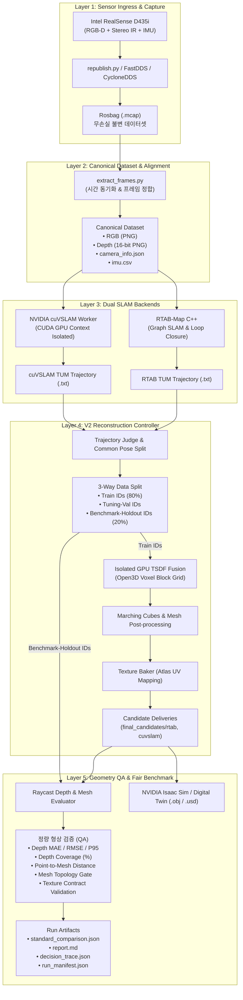

# 📐 Auto-Mobility

> **RealSense D435i 기반 Dual-SLAM(RTAB-Map & NVIDIA cuVSLAM) 및 GPU TSDF Real-to-Sim 3D 공간 복원 & 정량 품질 검증(QA) 파이프라인**

Auto-Mobility는 실제 물리 공간에서 센서 데이터를 수집하여 고정밀 3D 표면 메쉬(Digital Twin)를 생성하고, 실제 센서 관측값(Held-out Depth)을 기반으로 기하학적 정밀도를 수학적으로 검증하여 **NVIDIA Isaac Sim / 로봇 시뮬레이션 환경으로 연결하는 파이프라인 시스템**입니다.

루프 결합 기반의 **RTAB-Map**과 CUDA 가속 초고속 비주얼 SLAM인 **NVIDIA cuVSLAM**을 양대 메인 SLAM 백엔드로 채택하여 동일한 불변 데이터셋 위에서 공정하게 비교·융합하며, GPU TSDF Voxel Block Grid 기반의 고성능 3D 복원 및 엄격한 데이터 누수 방지(Zero Data Leakage) 형상 품질 평가(Geometry QA) 체계를 제공합니다.

---

## 📑 목차
1. [프로젝트 개요 및 핵심 가치](#-프로젝트-개요-및-핵심-가치)
2. [시스템 아키텍처 (Layered Architecture)](#-시스템-아키텍처-layered-architecture)
3. [데이터 파이프라인 흐름 (Data Flow)](#-데이터-파이프라인-흐름-data-flow)
4. [실행 모드 (Execution Modes)](#-실행-모드-execution-modes)
5. [프로젝트 디렉터리 구조](#-프로젝트-디렉터리-구조)
6. [주요 알고리즘 및 기술적 상세](#-주요-알고리즘-및-기술적-상세)
   - [Dual SLAM 백엔드 (RTAB-Map & cuVSLAM)](#1-dual-slam-백엔드-rtab-map--nvidia-cuvslam)
   - [Zero-Data-Leakage 3-Way 데이터 분할](#2-zero-data-leakage-3-way-데이터-분할)
   - [V2 3D 복원 및 텍스처 베이킹 엔진](#3-v2-3d-복원-및-텍스처-베이킹-엔진)
   - [정량적 형상 품질 검증 (Geometry QA Engine)](#4-정량적-형상-품질-검증-geometry-qa-engine)
   - [프로세스 격리 및 런타임 텔레메트리](#5-프로세스-격리-및-런타임-텔레메트리)
7. [기술 스택 (Tech Stack)](#-기술-스택-tech-stack)
8. [관련 문서 및 가이드](#-관련-문서-및-가이드)

---

## 🎯 프로젝트 개요 및 핵심 가치

기존의 3D 스캔 및 SLAM 파이프라인은 특정 단일 알고리즘에 의존하거나, 시각적 외형(Texture)에만 치중하여 실제 로봇 시뮬레이션에 필수적인 **물리적 치수 정밀도 및 기하학적 무결성**을 보장하기 어려웠습니다. 또한 복원에 사용된 프레임으로 모델을 평가하는 데이터 누수(Data Leakage) 문제가 빈번했습니다.

Auto-Mobility는 다음과 같은 핵심 엔지니어링 설계를 통해 이를 해결합니다:

1. **Dual-Backend SLAM 공정 비교 (RTAB-Map vs NVIDIA cuVSLAM)**  
   - 전역 루프 결합(Loop Closure)과 그래프 최적화에 강한 **RTAB-Map**과 고속 GPU 가속 비주얼 오도메트리/SLAM에 최적화된 **NVIDIA cuVSLAM**을 동일 조건에서 실행하고 궤적 정밀도를 공정하게 비교·선정합니다.
2. **Zero-Data-Leakage 3-Way 데이터 분할**  
   - 두 SLAM 백엔드 공통 FUSE 프레임에서 `Train(탐색/복원)`, `Tuning-Val(파라미터 튜닝)`, `Benchmark-Holdout(최종 평가)`으로 엄격히 분리하여, 모델 생성에 전혀 관여하지 않은 순수 센서 프레임으로만 기하학적 품질을 평가합니다.
3. **GPU 가속 TSDF Voxel Block Grid & Texture Atlas**  
   - Open3D GPU VBG 기반의 Truncated Signed Distance Function 융합 및 Marching Cubes 표면 추출, 그리고 다중 뷰 기반 UV Texture Atlas 베이킹을 통해 실내 공간의 고품질 메쉬 및 텍스처를 생성합니다.
4. **센서 기반 정량 품질 검증 (Geometry & Topology QA)**  
   - Held-out 센서 시점에서 가상 메쉬로 레이캐스팅(Raycasting)하여 Depth MAE, RMSE, P95 Tail Error, Coverage(%), Point-to-Mesh 거리 및 비다양체(Non-manifold) 위상 결함을 정량 측정하고 판정 게이트를 통과시킵니다.
5. **서브프로세스 격리 (Subprocess Isolation) & 하드웨어 텔레메트리**  
   - CUDA Context 및 VRAM 누수를 방지하기 위해 무거운 SLAM 및 TSDF 연산을 독립 프로세스로 격리 실행하며, GPU/CPU 발열 및 메모리 사용량을 실시간 모니터링하여 안전하게 제어합니다.

---

## 🏗️ 시스템 아키텍처 (Layered Architecture)

전체 시스템은 모듈 간 결합도를 낮추고 데이터 무결성을 보장하는 5단계 레이어드 아키텍처로 설계되었습니다.



---

## 🔄 데이터 파이프라인 흐름 (Data Flow)

| 단계 | 계층 명칭 | 입력 데이터 | 산출물 | 주요 역할 및 특징 |
| :--- | :--- | :--- | :--- | :--- |
| **01** | **Sensor Ingress** | D435i 센서 스트림 | Rosbag (`.mcap`) | 고대역폭 RGB-D 및 IMU 센서 데이터의 무손실 기록, 드롭아웃 및 시계열 무결성 보장 |
| **02** | **Canonical Dataset** | Rosbag (`.mcap`) | `frames/` | 타임스탬프 기반 RGB/Depth 정밀 동기화, 센서 메타데이터 표준 JSON 규격화 |
| **03** | **Dual SLAM Tracking** | Frames / Bag | `trajectories/` (`.txt`) | **RTAB-Map** 및 **NVIDIA cuVSLAM**을 통한 6-DoF 카메라 궤적 병렬/독립 계산 |
| **04** | **3-Way Data Split** | Common Pose Frames | Train / Val / Holdout | Data Leakage 원천 차단을 위한 불변 프레임셋 분할 (Holdout은 복원에서 엄격 배제) |
| **05** | **GPU TSDF & Atlas** | Train Frames + Trajectory | `model.obj`, `model.mtl`, textures | Open3D GPU TSDF VBG 퓨전, 표면 정제 및 UV 텍스처 아틀라스 베이킹 |
| **06** | **Geometry QA & Report** | Final Mesh + Holdout Depth | `report.md`, `comparison.json` | 가상 레이캐스팅 기반 정량 오차 측정, 백엔드 승자 판정 및 무결성 Manifest 발행 |

---

## ⚡ 실행 모드 (Execution Modes)

파이프라인은 목적과 리소스 예산에 따라 세분화된 실행 모드를 지원합니다:

| 모드 | CLI 플래그 | 대상 용도 | 융합 프레임 규모 | 주요 특징 |
| :--- | :--- | :--- | :--- | :--- |
| **Preview** | `--preview` | 신속한 시각화 및 파이프라인 사전 점검 | 최대 800 프레임 (Pose-space Coverage) | RTAB-Map & cuVSLAM 듀얼 OBJ 신속 생성, 15분 이내 완료 |
| **Standard** | `--standard` | **프로덕션 표준 고정밀 복원 및 듀얼 비교** | 전체 유효 FUSE 프레임 | Coarse-to-Fine 복셀 탐색, 엄격한 Holdout QA, 최종 승자 선정 |
| **Fast-Compare** | `--fast-compare` | Standard 기반 고속 듀얼 백엔드 비교 | 1,600 ~ 2,000 프레임 | 적응형 프레임 샘플링, 텍스처 뷰 최적화, 신속한 벤치마크 리포트 |
| **Quick** | `--quick` | 개발자 스모크 테스트 / 파이프라인 헬스체크 | 최소 프레임셋 | 단위 모듈 및 입출력 인터페이스 정상 동작 확인용 |

---

## 📁 프로젝트 디렉터리 구조

```bash
auto-mobility/
├── config/                         # 파이프라인, SLAM 캘리브레이션 및 네트워크 설정
│   ├── dds/                        # FastDDS / CycloneDDS QoS 프로파일
│   ├── evaluation.yaml             # QA 품질 판정 임계치(Threshold), 가중치 및 Split 설정
│   ├── orbslam3_rgbd_custom.yaml   # (레거시) ORB-SLAM3 카메라 설정
│   ├── stella_vslam_d435i.yaml     # (레거시) Stella-VSLAM 파라미터
│   └── topics.yaml                 # ROS2 토픽 매핑 구성
│
├── docs/                           # 상세 기술 문서 및 사용자 가이드
│   ├── guide.md                    # 실전 파이프라인 실행 가이드 및 명령어 치트시트
│   └── proposal_2026.pdf           # 프로젝트 제안서 및 아키텍처 문서
│
├── launch/                         # ROS2 Launch 스크립트
│   ├── camera.launch.py            # RealSense D435i 카메라 드라이버 & Republish 런치
│   ├── rtab_live.launch.py         # 실시간 RTAB-Map SLAM 실행
│   └── rtab_bag.launch.py          # Rosbag 재생 기반 RTAB-Map SLAM 실행
│
├── scripts/                        # 파이프라인 실행 및 개발 지원 스크립트
│   ├── pipeline/                   # 사용자용 파이프라인 자동화 쉘 스크립트
│   │   ├── capture_safe.sh         # 센서 상태 감시 기반 안전 녹화
│   │   ├── prepare_dataset.sh      # Canonical Dataset 프레임 추출
│   │   ├── run_slam.sh             # SLAM 백엔드 실행 래퍼
│   │   ├── mesh.sh                 # 3D 점군 및 메쉬 복원
│   │   ├── evaluate.sh             # 단일 메쉬 정량 QA 평가
│   │   ├── compare.sh              # Multi-Axis 다축 벤치마크 및 듀얼 비교 실행
│   │   └── isaac.sh                # Isaac Sim 연동용 데이터 변환
│   ├── dev/                        # 개발자 벤치마크 및 GPU 게이트 스크립트
│   └── utils/                      # 3D 뷰어, 네트워크/카메라 검증 도구
│
├── src/auto_mobility/              # 핵심 소스 코드 패키지 (Python / C++)
│   ├── reconstruction/             # [핵심] V2 복원 및 오케스트레이션 엔진
│   │   ├── cli.py                  # V2 통합 CLI 엔트리포인트
│   │   ├── pipeline/               # Standard / Preview 파이프라인 컨트롤러
│   │   ├── pose/                   # SLAM 백엔드 어댑터 (cuvslam_worker, rtab), ICP 포즈 정제, Judge
│   │   ├── data/                   # Zero-Leakage 3-Way Frame Splitter, Audit, Frame Selector
│   │   ├── fusion/                 # Open3D GPU TSDF VBG 퓨전 및 격리 서브프로세스 워커
│   │   ├── depth/                  # 다중 뷰 Depth 일관성 필터
│   │   ├── appearance/             # UV Texture Atlas Baker (`bake_atlas`) 및 Texture Contract
│   │   ├── evaluation/             # Raycast Depth MAE/P95 평가, 랭킹 및 리포트 생성기
│   │   ├── runtime/                # Machine Profile, Resource Budget Manager, Thermal Telemetry
│   │   └── artifacts/              # SHA-256 기반 아티팩트 스토어 및 불변 Identity 관리
│   ├── slam/                       # C++ 오프라인 SLAM 백엔드 (rtabmap_offline 등)
│   ├── dataset/                    # 프레임 추출, 시간 동기화, 데이터셋 정합성 검증
│   ├── diagnostics/                # 센서 시계열, 프레임 품질, 궤적 건전성 진단
│   ├── evaluation/                 # 레거시 호환 형상 품질 평가 모듈
│   ├── mesh/                       # 레거시 3D 점군/메쉬 생성 및 뷰어
│   ├── nodes/                      # ROS2 통신 노드 (Republish, Throttle, TF Pub)
│   └── isaac/                      # NVIDIA Isaac Sim / Lab 메쉬 로더
│
├── output_preview/<bag>/           # [Preview 모드 산출물]
│   └── <run_id>/                   # 실행별 격리 디렉터리 (OBJs, decision_trace, report.md)
│
├── output_standard/<bag>/          # [Standard 모드 산출물]
│   └── <run_id>/                   # 실행별 격리 디렉터리 (final_candidates/, comparison.json)
│
├── ros2_data/                      # [런타임 원본 데이터 저장소]
│   ├── bags/                       # 원본 MCAP Rosbag 데이터셋
│   ├── frames/                     # Canonical Frame Dataset (RGB, Depth, IMU, camera_info.json)
│   ├── databases/                  # RTAB-Map SLAM 세션 데이터베이스 (.db)
│   └── trajectories/               # 표준 TUM 포맷 카메라 궤적 파일 (.txt)
│
└── tests/                          # 단위 테스트 및 파이프라인 통합 테스트 슈트
```

---

## 🔬 주요 알고리즘 및 기술적 상세

### 1. Dual SLAM 백엔드 (RTAB-Map & NVIDIA cuVSLAM)
카메라 이동 궤적(6-DoF Trajectory)을 정밀하고 안정적으로 추정하기 위해 상호 보완적인 두 백엔드를 메인으로 운용합니다.

```text
               ┌──▶ [RTAB-Map (C++)] ──────▶ Loop Closure & Graph Optimization ──┐
[Canonical] ───┤                                                                 ├──▶ [TUM Trajectory]
[Dataset  ] ───┴──▶ [cuVSLAM (CUDA)] ──────▶ Isolated GPU Context & Fast Tracking ─┘
```

* **RTAB-Map (Real-Time Appearance-Based Mapping)**:
  * RGB-D 프레임에서 메모리 관리(STM/WM/LTM) 기법을 사용하여 전역 루프 결합(Loop Closure)을 감지하고, g2o/GTSAM 비선형 그래프 최적화를 수행합니다.
  * 복잡한 동선이나 회전이 많은 실내 환경에서 누적 드리프트(Drift)를 효과적으로 보정합니다.
* **NVIDIA cuVSLAM (CUDA-accelerated Visual SLAM)**:
  * GPU 하드웨어 가속을 기반으로 초고속 비주얼 오도메트리 및 SLAM을 수행합니다.
  * 빠른 카메라 움직임에서도 특징점 추적 성능이 뛰어나며, `cuvslam_worker.py`를 통해 **독립 CUDA 프로세스로 격리 실행**되어 메인 파이프라인의 VRAM 오염 및 메모리 누수를 원천 차단합니다.
* **Slerp Pose Interpolation & Trajectory Judge**:
  * SLAM 궤적의 타임스탬프와 센서 프레임 간의 오차를 쿼터니언 구면 선형 보간(Spherical Linear Interpolation)으로 보정합니다.
  * `TrajectoryJudge`가 두 백엔드의 추적 성공률, 커버리지, 연속성을 평가하여 유효 궤적을 판정합니다.

---

### 2. Zero-Data-Leakage 3-Way 데이터 분할
학습 데이터로 평가를 수행하여 수치가 과대평가되는 문제를 원천 차단하기 위해 **결정적 3-Way Split**을 강제합니다.

```text
[All Valid FUSE Frames in Trajectory]
                │
    ┌───────────┴───────────┐
    ▼                       ▼
[Reconstruction Pool]   [Benchmark Holdout Pool (20%)] ──▶ 절대 복원/탐색/텍스처링에 미사용!
    │                                                        │
    ├───────────────┐                                        │
    ▼               ▼                                        ▼
[Train IDs (80%)]  [Tuning-Val IDs]                 [Geometry QA Evaluation]
 (TSDF 융합 생성)   (복셀/파라미터 튜닝)            (Held-out Raycast Depth 오차 검증)
```

1. **Train IDs**: TSDF Voxel Block Grid 복원, ICP 포즈 정제, Coarse Mask 생성에만 사용됩니다.
2. **Tuning-Val IDs**: Standard 모드의 최적 복셀 해상도 탐색 및 파라미터 선택에만 사용됩니다.
3. **Benchmark-Holdout IDs**: 전체 공통 FUSE 프레임의 최소 20% 이상을 차지하며, **어떤 메쉬 생성, 복셀 탐색, 텍스처 뷰 선택에서도 완전 배제**됩니다. 최종 생성된 메쉬는 오직 이 프레임들로만 평가됩니다.

---

### 3. V2 3D 복원 및 텍스처 베이킹 엔진
* **Open3D GPU TSDF Voxel Block Grid (VBG)**:
  * GPU 메모리에 동적으로 복셀 블록을 할당하는 VBG 구조를 사용하여 넓은 실내 공간도 적은 메모리로 정밀하게 복원합니다.
  * Marching Cubes 알고리즘으로 등가면(Isosurface)을 추출하여 표면 메쉬를 형성합니다.
* **Multi-view Depth 일관성 필터 (Consistency Filter)**:
  * 인접 뷰 간의 Depth 재투영 검사를 통해 센서 노이즈 및 동적 물체 잔상을 필터링합니다.
* **Texture Atlas Baker (`bake_atlas`) & Contract**:
  * 복원된 3D 메쉬 표면에 대해 최적의 가시성(Visibility) 및 정면 각도를 가진 RGB 프레임을 선별하여 UV 텍스처 아틀라스를 베이킹합니다.
  * `model.obj`, `model.mtl`, 텍스처 이미지의 유효성(`usemtl`, `map_Kd`, UV Coverage)을 검사하는 **Texture Contract**를 거쳐 불완전한 메쉬의 배포를 방지합니다.

---

### 4. 정량적 형상 품질 검증 (Geometry QA Engine)
생성된 메쉬의 신뢰성을 센서 물리 관측값 기반으로 검증합니다.

```text
[실제 센서 Held-out Depth]                  [복원된 3D Mesh]
            │                                      │
            ▼                                      ▼
   (실제 관측 2D Depth)                   (가상 카메라 Raycast Depth)
            │                                      │
            └──────────────────┬───────────────────┘
                               ▼
                    [픽셀 단위 절대 오차 행렬]
                               │
       ┌───────────────────────┼───────────────────────┐
       ▼                       ▼                       ▼
  Depth MAE / RMSE        Depth P95 (Tail Error)   Depth Coverage (%)
```

* **Depth MAE / RMSE / Median (mm)**: 실제 센서 Depth와 메쉬 렌더링 Depth 간의 절대 오차 평균 및 제곱평균제곱근.
* **Depth P90 / P95 (mm)**: 오차 상위 5~10%의 최대 오차를 측정하여 벽면의 굴곡, 휨, 코너부 왜곡을 감지.
* **Depth Coverage Ratio (%)**: 실제 센서가 감지한 영역 중 유효하게 메쉬 표면이 생성된 비율.
* **Point-to-Mesh Distance (mm)**: 역투영된 3D 점군과 메쉬 표면 간의 kd-tree 최단 거리.
* **Mesh Topology Gate**: 비다양체 엣지/정점(Non-manifold), 기형 삼각면(Degenerate faces), 부유 파편 비율 검사.

---

### 5. 프로세스 격리 및 런타임 텔레메트리
* **Subprocess Isolation**:
  * Open3D TSDF 퓨전 및 cuVSLAM 실행을 별도의 파이썬 서브프로세스로 분리하여 실행 후 OS 레벨에서 VRAM 및 시스템 메모리가 100% 회수되도록 보장합니다.
* **Hardware Profile & Thermal Telemetry**:
  * `machine_profile.py`를 통해 호스트 GPU(NVIDIA VRAM) 및 CPU 코어 수를 자동 탐색합니다.
  * 실행 중 GPU/CPU 온도와 메모리를 주기적으로 수집(`telemetry.json`)하여 임계 온도 도달 시 안전하게 스로틀링합니다.
* **Artifact Store & Provenance**:
  * 모든 입력 데이터셋, 궤적, 메쉬 파일의 SHA-256 해시를 기록하여 결과물 재사용 및 캐시 히트(Cache Hit/Miss) 여부를 명확히 추적합니다.

---

## 🛠️ 기술 스택 (Tech Stack)

| 영역 | 기술 요소 | 세부 용도 |
| :--- | :--- | :--- |
| **SLAM Backends** | **RTAB-Map**, **NVIDIA cuVSLAM** | 메인 듀얼 SLAM (루프 결합 그래프 최적화 & CUDA 가속 비주얼 SLAM) |
| **3D & Reconstruction** | **Open3D (CUDA GPU)**, **OpenCV**, **Eigen3** | GPU TSDF Voxel Block Grid, Raycasting, 기하 연산, UV 텍스처링 |
| **Robotics Middleware** | **ROS2 Humble**, `rclcpp`, `rclpy` | 센서 토픽 통신, 시간 동기화, 오프라인 C++ 노드 |
| **DDS / Network** | **Eclipse CycloneDDS**, **eProsima FastDDS** | 고대역폭 RGB-D 센서 데이터 무손실 패스스루 QoS 구성 |
| **Languages** | **Python 3.10**, **C++17** | V2 파이프라인 컨트롤러 & 고속 오프라인 SLAM 백엔드 |
| **Digital Twin / Sim** | **NVIDIA Isaac Sim / Isaac Lab**, OBJ / MTL, USD | 로봇 시뮬레이션 환경용 3D 자산 로딩 및 검증 |

---

## 📖 관련 문서 및 가이드

* **[실전 파이프라인 실행 가이드 (docs/guide.md)](docs/guide.md)**: 데이터 촬영, SLAM 실행, 메쉬 생성, 품질 평가의 단계별 실행 명령어 및 실전 치트시트
* **[보조 및 레거시 유틸리티 가이드 (docs/legacy_and_utility_guide.md)](docs/legacy_and_utility_guide.md)**: 실시간 카메라 스트리밍, 대체 SLAM(ORB-SLAM3/Stella), 표면 복원(Poisson/BPA/Alpha/CGAL), Isaac Sim 및 센서 진단 도구
* **[평가 설정 파일 (config/evaluation.yaml)](config/evaluation.yaml)**: QA 평가 기준치(Threshold), 가중치, 파라미터 세부 명세
* **[토픽 및 네트워크 설정 (config/)](config/)**: CycloneDDS / FastDDS XML 및 카메라 파라미터 설정

---

<div align="center">
  <sub>Developed for High-Precision Real-to-Sim Robotics & Digital Twin Pipeline.</sub>
</div>


