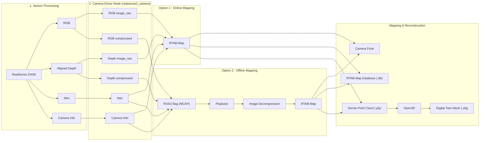

# 📐 Auto-Mobility System Architecture & Technical Specifications

본 문서는 RealSense D435i 센서 기반 **3D Visual SLAM 및 Digital Twin 파이프라인의 데이터 흐름, 시스템 아키텍처, 주요 설정 사양**을 설명하는 기술 명세서입니다.

---

## 🏗️ 1. 전체 시스템 아키텍처 (System Architecture)

전체 시스템은 **센서 수집 ➔ 압축 통신 ➔ 실시간 복원 ➔ 3D SLAM & 3D Mesh 변환**의 4단계 파이프라인으로 구성되어 있습니다.



---

## 📁 2. 프로젝트 디렉터리 구조 (Directory Structure)

```
auto-mobility/                         # [패키지 루트]
├── CMakeLists.txt                      # ROS2 CMake 빌드 파일
├── package.xml                         # ROS2 패키지 매니페스트
├── README.md                           # 시스템 명세서
│
├── src/                                # 🟢 ROS 2 정석 소스 디렉터리
│   └── auto_mobility/                  # Python 패키지 모듈
│       ├── nodes/
│       │   └── republish.py            # 압축 해제 재발행 노드
│       └── processing/
│           ├── mesh_open3d.py          # Open3D 3D Mesh 생성 모듈
│           ├── validate.py             # 데이터 품질 및 규격 검증 모듈
│           └── benchmark_hw.py         # 하드웨어 성능 벤치마크 모듈
│
├── scripts/                            # 🟡 CLI 실행 도구 (Shell Scripts)
│   ├── common.sh                       # 공통 환경설정
│   ├── pipeline/                       # 핵심 실행 파이프라인 (run_bag, run_live, record, play, mesh)
│   └── utils/                          # 유틸리티 도구 (check, export_ply, benchmark)
│
├── config/                             # ROS2 / FastDDS / RTAB-Map 설정 파일
├── launch/                             # ROS2 Launch 파일 (camera, rtab_bag, rtab_live)
├── rviz/                               # RViz2 디스플레이 구성 파일
└── docs/                               # 프로젝트 문서 및 사용 가이드 (guide.md)
```

---

## ⚙️ 3. 주요 시스템 사양 및 설정 (Technical Specifications)

### 📸 센서 및 카메라 설정 (`camera.launch.py`)

| 항목 | 설정값 | 상세 설명 |
| :--- | :--- | :--- |
| **카메라 모델** | Intel RealSense D435i | RGB-D + IMU 융합 센서 |
| **RGB 해상도 & FPS** | `640x480` @ **15 FPS** | RTAB-Map SLAM 정밀 특징점 추적 표준 해상도 |
| **Depth 해상도 & FPS** | `640x480` @ **15 FPS** | Z16 비손실 깊이 스트림 |
| **하드웨어 렌즈 정렬** | `align_depth.enable: True` | RGB-Depth 타임스탬프 오차를 400ms ➔ **1ms 이내로 자동 정렬** |
| **노출 고정** | `auto_exposure_priority: False` | 저조도 환경에서 프레임 레이트(FPS) 폭락 방지 |
| **IMU 센서** | `unite_imu_method: 1` | 가속도계 + 자이로스코프 데이터를 단일 스트림(~185Hz)으로 통합 |

---

### 📡 ROS 2 토픽 및 파이프라인 명세 (`common.sh`)

| 토픽 분류 | 토픽 이름 | 데이터 타입 | 비고 |
| :--- | :--- | :--- | :--- |
| **RGB (압축 기본)** | `/camera/camera/color/image_raw/compressed` | `sensor_msgs/msg/CompressedImage` | JPEG 손실 압축 (대역폭 1/10 절감) |
| **Depth (압축 기본)** | `/camera/camera/aligned_depth_to_color/image_raw/compressedDepth` | `sensor_msgs/msg/CompressedImage` | PNG 기반 비손실 깊이 압축 |
| **RGB (복원)** | `/camera/camera/color/image_raw` | `sensor_msgs/msg/Image` | `republish.py` 노드에 의해 실시간 복원 |
| **Depth (복원)** | `/camera/camera/aligned_depth_to_color/image_raw` | `sensor_msgs/msg/Image` | `republish.py` 노드에 의해 실시간 복원 |
| **Camera Info** | `/camera/camera/color/camera_info` | `sensor_msgs/msg/CameraInfo` | 렌즈 내부 캘리브레이션 매개변수 |
| **IMU** | `/camera/camera/imu` | `sensor_msgs/msg/Imu` | 모션 추정 보조 데이터 |

---

### 🗺️ 3D Visual SLAM 파라미터 최적화 (`src/auto_mobility/launch_common.py`)

> **단일 소스 관리**: `rtab_live` / `rtab_bag` launch는 `RTABMAP_ARGS`를 공유합니다. 튜닝은 `launch_common.py` 한 곳에서만 수행하면 양쪽에 동일하게 적용됩니다.

* **시간 동기화 허용 오차 (`approx_sync_max_interval`)**: `0.15` (150ms)
  * 프레임 간 타임스탬프 미세 오차 수용 및 동기화 무한 대기 방지.
* **큐 크기 (`topic_queue_size`)**: `30`
  * 대용량 파이프라인 처리 중 프레임 유실(Drop) 방지.
* **프레임 버림 방지 (`always_process_most_recent_frame`)**: `false`
  * 모든 프레임을 순차적으로 처리하여 연속적인 특징점 추적 유지.
* **특징점 검출 강화** (`Vis/MaxFeatures 1500`, `Vis/CornerMinQuality 0.01`, `Vis/CornerGridSize 20`, `Vis/MinDepth 0.3`, `Vis/MaxDepth 8.0`, `Vis/MinInliers 10`)
  * 흰 벽/복도 등 텍스처 부재 환경에서 특징점 검출 실패(`fromWords=0`)로 인한 오도메트리 끊김 방지.
* **매칭 추정 분리** (`Odom/PoseGuessMode 0`)
  * IMU 구독/사용은 유지하되, 매칭 초기 추정을 드리프트된 IMU yaw에 의존하지 않도록 분리.
* **추적 끊김 자동 복구** (`Odom/ResetCountdown 2`, `Rtabmap/ResetCountdown 0`, `RGBD/CreateIntermediateNodes`, `RGBD/ProximityBySpace`, `RGBD/OptimizeFromGraphEnd`)
  * 추적 손실 시 빠른 재시도. `Rtabmap/ResetCountdown 0`은 지도 전체 리셋을 비활성화하여 벽 구간 통과 시 세션을 유지합니다.
* **키프레임 전략** (`Mem/STMSize 20`, `RGBD/LinearUpdate 0.2`, `RGBD/AngularUpdate 0.2`)
  * 드리프트 축적 완화 및 정지 상태에서의 불필요한 키프레임 생성 방지.

---

## ✨ 4. 파이프라인의 핵심 기능 및 차별점

1. **가상머신(VM) 디스크 I/O 병목 완벽 해결**:
   * Raw 비디오 전송 시 요구되는 초당 100MB 대역폭을 **10MB 이하로 압축 파이프라인 설계**하여 FPS 폭락 현상을 완벽하게 예방.
2. **이중 폴백 레거시 호환 (Dual Fallback Decompression)**:
   * 구형 녹화본(`depth/image_rect_raw`)과 신규 하드웨어 정렬 녹화본(`aligned_depth_to_color`)을 이중 구독 복원 노드가 자동 감지하여 단일 표준 채널로 유연하게 복원.
3. **Open3D 기반 Digital Twin 3D Mesh 생성**:
   * RTAB-Map spatial DB(`.db`)에서 Point Cloud를 추출한 후 노이즈 제거 및 Poisson Surface Reconstruction을 거쳐 **Digital Twin 3D 모델(.obj)**로 정제.
