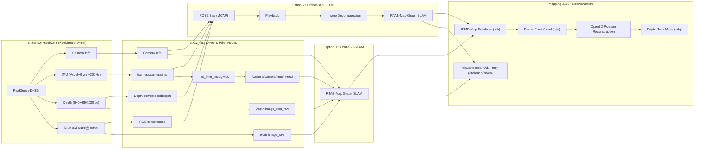

# 📐 Auto-Mobility System Architecture & Technical Specifications

본 문서는 RealSense D435i 센서 기반 **Visual-Inertial 3D SLAM 및 Digital Twin 파이프라인의 데이터 흐름, 시스템 아키텍처, 주요 설정 사양**을 설명하는 기술 명세서입니다.

---

## 🏗️ 1. 전체 시스템 아키텍처 (System Architecture)

전체 시스템은 **센서 수집 & IMU 필터링 ➔ DDS 압축 통신 ➔ 실시간 융합 SLAM ➔ 3D Mesh 변환** 파이프라인으로 구성되어 있습니다.



---

## 📁 2. 프로젝트 디렉터리 구조 (Directory Structure)

```
auto-mobility/                         # [패키지 루트]
├── CMakeLists.txt                      # ROS2 CMake 빌드 파일
├── package.xml                         # ROS2 패키지 매니페스트
├── README.md                           # 시스템 아키텍처 및 설정 명세서
│
├── src/                                # 🟢 ROS 2 정석 소스 디렉터리
│   └── auto_mobility/                  # Python 패키지 모듈
│       ├── launch_common.py            # RTAB-Map 파라미터 단일 소스 설정
│       ├── nodes/
│       │   └── republish.py            # 압축 해제 재발행 노드
│       └── processing/
│           ├── mesh_open3d.py          # Open3D 3D Mesh 생성 모듈
│           ├── validate.py             # 데이터 품질 및 무결성 검증 모듈
│           ├── benchmark_hw.py         # 1단계 센서/DDS 벤치마크 모듈
│           └── benchmark_slam.py       # 통합 SLAM 파이프라인 벤치마크 모듈
│
├── scripts/                            # 🟡 CLI 실행 도구 (Shell Scripts)
│   ├── common.sh                       # 공통 환경설정 및 PYTHONPATH 정의
│   ├── pipeline/                       # 핵심 실행 파이프라인 (run_live, run_bag, record, play, mesh)
│   └── utils/                          # 유틸리티 도구 (check, export_ply, view_mesh)
│
├── config/                             # FastDDS 및 RViz2 디스플레이 구성 파일
│   ├── fastdds_camera.xml              # FastDDS Shared Memory (SHM) 프로필
│   └── rtabmap_vmware.rviz             # VMware 최적화 RViz2 디스플레이 구성
├── launch/                             # ROS2 Launch 파일 (camera, rtab_live, rtab_bag)
└── docs/                               # 개발자 파이프라인 운영 가이드 (guide.md)
```

---

## ⚙️ 3. 주요 시스템 사양 및 설정 (Technical Specifications)

### 📸 센서 및 카메라 설정 (`launch/camera.launch.py`)

| 항목 | 설정값 | 상세 설명 |
| :--- | :--- | :--- |
| **카메라 모델** | Intel RealSense D435i | RGB-D + IMU (가속도계 + 자이로스코프) |
| **RGB 해상도 & FPS** | `640x480` @ **30 FPS** | RGB8 포맷, RTAB-Map SLAM 특징점 추적 최적 해상도 |
| **Depth 해상도 & FPS** | `640x480` @ **30 FPS** | Z16 비손실 깊이 스트림 |
| **IMU 센서 스트림** | `enable_accel: True`, `enable_gyro: True` | Accel(100Hz) + Gyro(200Hz) 모션 모듈 활성화 |
| **IMU 통합 방식** | `unite_imu_method: 1` | Accel/Gyro 데이터를 단일 `/camera/camera/imu` 토픽(~200Hz)으로 통합 |
| **노출 고정** | `auto_exposure_priority: False` | 저조도 환경에서 프레임 레이트(FPS) 폭락 방지 |

---

### 📡 ROS 2 토픽 및 파이프라인 명세 (`scripts/common.sh`)

| 토픽 분류 | 토픽 이름 | 데이터 타입 | 비고 / 주파수 |
| :--- | :--- | :--- | :--- |
| **Raw RGB** | `/camera/camera/color/image_raw` | `sensor_msgs/msg/Image` | RGB8, **30 Hz** |
| **Raw Depth** | `/camera/camera/depth/image_rect_raw` | `sensor_msgs/msg/Image` | Z16 16UC1, **30 Hz** |
| **Raw IMU** | `/camera/camera/imu` | `sensor_msgs/msg/Imu` | Accel+Gyro 통합, **200.4 Hz** |
| **Filtered IMU** | `/camera/camera/imu/filtered` | `sensor_msgs/msg/Imu` | Madgwick 필터 Orientation 포함, **200.0 Hz** |
| **Camera Info** | `/camera/camera/color/camera_info` | `sensor_msgs/msg/CameraInfo` | 렌즈 내부 캘리브레이션 정보 |
| **Visual-Inertial Odom**| `/rtabmap/odom` | `nav_msgs/msg/Odometry` | IMU 융합 visual odometry, **~5 Hz** |

---

### 🗺️ 3D Visual-Inertial SLAM 파라미터 최적화 (`src/auto_mobility/launch_common.py`)

> **단일 소스 관리**: `rtab_live` / `rtab_bag` launch는 `RTABMAP_ARGS`를 공유합니다. 튜닝은 `launch_common.py` 한 곳에서만 관리됩니다.

* **IMU 중력 가속도 수평 정렬 (`Optimizer/GravityProvided true`)**:
  * Madgwick 필터의 IMU 자세 추정치를 사용해 3D 포인트 클라우드 맵의 수평을 자동 유지(Pitch/Roll 드리프트 차단).
* **IMU 자세 초기 추정치 활용 (`Odom/PoseGuessMode 1`)**:
  * 급격한 카메라 회전이나 흰 벽 등 텍스처 부재 구간 통과 시 IMU 자세를 초기 Guess로 활용해 추적 손실(Odometry Lost)을 예방.
* **시간 동기화 허용 오차 (`approx_sync_max_interval`)**: `0.15` (150ms)
  * 센서 간 타임스탬프 미세 오차 수용.
* **특징점 검출 및 추적 안정화** (`Vis/MaxFeatures 1500`, `Vis/MinInliers 8`, `Vis/CornerMinQuality 0.01`, `Vis/CornerGridSize 30`)
  * 특징점 탐색 품질을 고도화하여 오도메트리 추적 유지력 증대.
* **병렬 검출 멀티스레딩** (`Vis/CornerNbThreads 8`, `OdomF2M/MaxFrames 5`)
  * 특징점 검출을 VM vCPU 수(8)로 병렬화하고 로컬 맵 버퍼를 관리하여 실시간성 확보.
* **CPU 분산 및 키프레임 전략** (`Rtabmap/DetectionRate 5`, `RGBD/LinearUpdate 0.2`, `RGBD/AngularUpdate 0.2`)
  * 맵핑 루프를 5Hz로 제어해 odometry 컴퓨팅 자원을 확보하고 불필요한 키프레임 낭비 방지.

---

## ✨ 4. 파이프라인의 핵심 차별점

1. **하드웨어 기반 IMU + Visual SLAM 센서 융합**:
   * RealSense D435i 물리 Motion Module(200Hz) 데이터를 `imu_filter_madgwick`으로 처리하여 지도의 중력 수평축 및 추적 초기값으로 직접 활용.
2. **VMware 가상화 맞춤 대역폭 & 멀티스레딩 설계**:
   * FastDDS Shared Memory(SHM) 및 vCPU 8 스레드 병렬화를 적용하여 80% 이상의 CPU 효율과 안정적인 30 FPS 카메라 수집 달성.
3. **Open3D 기반 Digital Twin 3D Mesh 복원**:
   * RTAB-Map spatial DB(`.db`)의 Point Cloud에서 Poisson Surface Reconstruction과 품질 검증 장치를 거쳐 Digital Twin 3D 모델(`.obj`)을 자동 복원.
