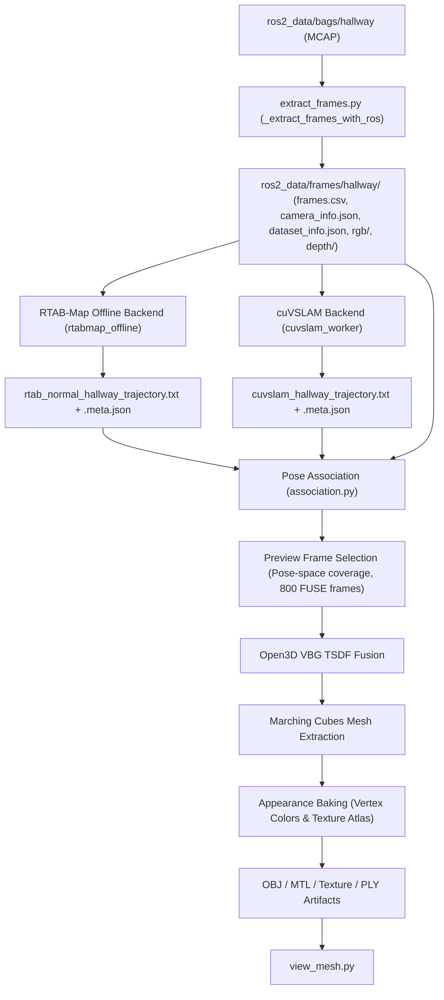

# Pipeline Contract & End-to-End Data Flow Audit

## Repository & Environment State
- **Git Commit (HEAD)**: `b181f14c58570ed24dcccb17aeb18a215dd54f8c`
- **Git Status**: Clean working tree with `feedback.md` and `next.md` present.
- **Git Diff**: None (baseline)
- **Target Bag**: `ros2_data/bags/hallway` (`hallway_0.mcap`, 200.29s, 52,213 messages)
- **Investigation Command**: `./scripts/pipeline/compare.sh hallway --preview --run-slam`

---

## End-to-End Pipeline Data Flow

---

## Boundary Contract Specifications

### 1. Rosbag2 / MCAP Input (`ros2_data/bags/hallway`)
- **Format**: MCAP ROS 2 bag (CDR serialization)
- **Topics**:
  - `/camera/camera/color/image_raw/compressed` (sensor_msgs/msg/CompressedImage, 5,647 msgs, ~28.2 Hz)
  - `/camera/camera/depth/image_rect_raw/compressedDepth` (sensor_msgs/msg/CompressedImage, 5,970 msgs, ~29.8 Hz)
  - `/camera/camera/color/camera_info_windows` (sensor_msgs/msg/CameraInfo, 200 msgs, 1 Hz)
  - `/camera/camera/imu` (sensor_msgs/msg/Imu, 40,395 msgs, ~200 Hz)
  - `/tf_static` (tf2_msgs/msg/TFMessage, 1 msg)
- **Timestamps**: Sensor header stamps (`header.stamp`) in nanoseconds/seconds.
- **Color Format**: Compressed JPEG / PNG BGR8/RGB8.
- **Depth Format**: `16UC1` PNG compressed depth (uint16, millimeter units).
- **Static TF**:
  - `camera_link -> camera_color_optical_frame`: translation `(0.015, 0.0, 0.0)`, rotation `(-0.5, 0.5, -0.5, 0.5)`
  - `camera_link -> camera_depth_optical_frame`: translation `(0.0, 0.0, 0.0)`, rotation `(-0.5, 0.5, -0.5, 0.5)`

### 2. Canonical Dataset (`extract_frames.py`)
- **Directory**: `ros2_data/frames/hallway/`
- **RGB Output**: `rgb/%06d.png` (8-bit BGR image, 640x480)
- **Depth Output**: `depth/%06d.png` (16-bit uint16 grayscale, units: millimeters, 640x480)
- **Camera Intrinsics** (`camera_info.json`):
  - $f_x = 606.538696$, $f_y = 606.493530$, $c_x = 324.499054$, $c_y = 241.704651$, $W=640$, $H=480$.
  - Sourced directly from `/camera/camera/color/camera_info_windows` (`is_fallback: false`).
- **Synchronization**: Strict nearest-timestamp matching with threshold $\Delta t \le 50\,\text{ms}$. (Mean $\Delta t = 0.065\,\text{ms}$, P95 = $0.0\,\text{ms}$).
- **Monotonicity**: Strict monotonically increasing timestamps guaranteed.

### 3. RTAB-Map Standalone Backend (`rtabmap_offline.cpp`)
- **Input**: Canonical `frames.csv` + `camera_info.json` + `rgb/` + `depth/`.
- **Internal Model**: `rtabmap::CameraModel` with local transform:
  $$R_{\text{base\_cam}} = \begin{bmatrix} 0 & 0 & 1 \\ -1 & 0 & 0 \\ 0 & -1 & 0 \end{bmatrix}, \quad t = [0, 0, 0]^T$$
  which maps camera optical coordinates into the ROS robot base frame.
- **Coordinate Transformation Required**:
  - RTAB database / odometry calculates $T_{\text{world\_base}}$.
  - The downstream fusion contract strictly requires $T_{\text{world\_camera\_optical}}$.
  - Transformation relation: $T_{\text{world\_camera\_optical}} = T_{\text{world\_base}} \times T_{\text{base\_camera}}$.
- **Graph Optimization**:
  - Must extract global graph poses using `rtabmap.getGraph(poses, constraints, true, true)` mapped to location IDs via `getLastLocationId()`.
  - Exported Trajectory: TUM format ($t, x, y, z, q_x, q_y, q_z, q_w$).

### 4. cuVSLAM Backend (`cuvslam_worker.py`)
- **Input**: Canonical `frames.csv` + `camera_info.json` + `rgb/` + `depth/`.
- **Camera Configuration**:
  - `rig_from_camera = Pose(rotation=[0,0,0,1], translation=[0,0,0])`
  - Camera optical coordinate system (+Z forward, +X right, +Y down).
  - Poses output by cuVSLAM are directly $T_{\text{world\_camera\_optical}}$.
- **Configuration Fix**:
  - `max_map_size = 0` (unlimited, preventing map truncation on long corridors).
  - Output Trajectory: Retrospectively optimized SLAM poses in TUM format.

### 5. Trajectory Cache & Sidecar Validation
- **Trajectory Format**: TUM text file (`ros2_data/trajectories/<name>_trajectory.txt`).
- **Sidecar Metadata** (`.meta.json`):
  - `schema_version`: Bumped to `recon-v3/sidecar-3`
  - `pose_convention`: `"T_world_camera"`
  - `pose_frame`: `"camera_color_optical_frame"`
  - `backend`: `"rtab"` or `"cuvslam"`
  - `dataset_fingerprint`: SHA256 of `frames.csv` and `camera_info.json`
  - `trajectory_sha256`: SHA256 of trajectory file.
  - Fail-closed if schema version or coordinate frame contract mismatches.

### 6. Frame <-> Pose Association (`association.py`)
- **Contract**: Single authoritative association implementation.
- **Max Gap**: Strict $50\,\text{ms}$ threshold (no 200 ms loose fallback).
- **Interpolation**: SLERP for rotation, linear for translation between valid adjacent bounding poses.
- **Tracking Loss Guard**: Frames during SLAM tracking loss are dropped, never bridged with stale poses.
- **Diagnostics**: Emits full association metrics JSON & CSV.

### 7. TSDF Fusion & Masking
- **Engine**: Open3D VoxelBlockGrid TSDF.
- **Extrinsics**: $T_{\text{camera\_world}} = \text{inv}(T_{\text{world\_camera\_optical}})$.
- **Consistency Mask**: Corrected so that pixels with no coarse mesh render ($d_{\text{rendered}} \le 0$) preserve their valid raw depth rather than being aggressively masked out. Outlier rejection only triggers when both real and rendered depth exist and disagree beyond tolerance.

### 8. Appearance & Texture Baking (`texture_baker.py`)
- **Vertex Colors**: Sampled with strict projection validity check (in-frustum, $z > 0$, positive facing angle, depth consistency). No $(0,0,0)$ black values injected on invalid projections.
- **Metrics**: Truthfully reporting vertex color coverage vs true UV texture coverage.

### 9. Mesh Viewer (`view_mesh.py`)
- **Loader**: Direct Open3D loading with content-hash based caching and `--no-cache` support.
