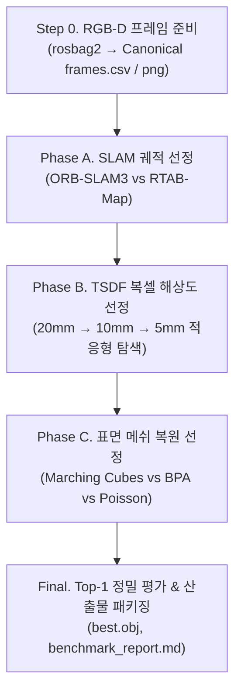

# 📊 SLAM & 3D Reconstruction 벤치마크 가이드

`scripts/pipeline/compare.sh`를 통한 3D 복원 파이프라인 자동 최적화 및 벤치마크 실행 가이드입니다.

---

## 🚀 1. CLI 실행 방법

```bash
./scripts/pipeline/compare.sh <BAG_NAME> [옵션]
```

### 실행 옵션 요약
| 구분 | 플래그 | 설명 |
|---|---|---|
| **모드** | *(기본값)* / `--standard` | 권장 적응형 Coarse-to-Fine 탐색 |
| | `--quick` | 빠른 디버깅용 (적은 프레임/후보군) |
| | `--full` | 모든 복셀/알고리즘 완전 탐색 |
| **단계** | `--phase=all` *(기본)* | Phase A → Phase B → Phase C 전체 실행 |
| | `--phase=a` / `--phase=slam` | Phase A (SLAM 궤적 비교)만 실행 |
| | `--phase=b` / `--phase=tsdf` | Phase B (TSDF 복셀 해상도 비교)만 실행 |
| | `--phase=c` / `--phase=surface` | Phase C (표면 복원 알고리즘 비교)만 실행 |
| **제어** | `--run-slam` | 궤적 누락 시 `run_slam.sh`로 자동 생성 |
| | `--no-cache` (`--force`) | 기존 캐시 무시하고 강제 재생성 |
| | `--top-k N` | 수동 검수용 상위 메쉬 복사 개수 (기본: 3) |

```bash
# 기본 권장 실행
./scripts/pipeline/compare.sh room01

# SLAM 궤적 자동 생성 포함 실행
./scripts/pipeline/compare.sh room01 --run-slam

# 표면 복원(Phase C)만 단독 실행
./scripts/pipeline/compare.sh room01 --phase=c
```

---

## 🔄 2. 주요 로직 흐름



### [Step 0] Canonical RGB-D 프레임 준비
- `rosbag2`에서 동기화된 RGB, Depth 이미지 및 카메라 파라미터(`camera_info.json`)를 추출합니다.
- Open3D 런타임 충돌을 방지하기 위해 단기 격리된 ROS 서브프로세스에서 처리됩니다.

### [Phase A] SLAM 궤적 선정 (Trajectory Selection)
- **비교 대상**: ORB-SLAM3, RTAB-Map 등 생성된 SLAM 궤적
- **평가 기준**: ATE RMSE (절대 궤적 오차), Trajectory Coverage (추적 성공률)
- **동작**: 최고 점수를 획득한 SLAM 궤적이 Phase B/C의 입력으로 확정됩니다.

### [Phase B] TSDF 복셀 해상도 선정 (Voxel Optimization)
- **탐색 범위**: 20mm(Coarse) → 10mm(Mid) → 5mm(Fine)
- **적응형 가지치기 (Adaptive Pruning)**:
  - 20mm/10mm 결과 대비 기하 복원 품질 향상이 미미하거나 가용 메모리가 부족할 경우 고비용 5mm 탐색을 자동 생략합니다.
- **평가 기준**: Hold-out 프레임 Depth 렌더링 오차(L1/PSNR) 및 재구성 속도/메모리 비용

### [Phase C] 표면 복원 알고리즘 선정 (Surface Reconstruction)
- **비교 대상**: 
  - `Voxel Marching Cubes` (TSDF 기본 등가면 추출)
  - `Ball Pivoting Algorithm (BPA)` (포인트 클라우드 기반 피봇팅)
  - `Screened Poisson Reconstruction` (밀폐형 수밀 메쉬 생성)
- **평가 기준**: 메쉬 완전성(Completeness), 노이즈/비정상 면(Non-manifold) 비율, 평면 피팅 오차

### [Final] Top-1 정밀 검증 및 최종 산출물 패키징
- 1위로 선정된 최적 조합(Winner Pipeline)에 대해 고해상도 Full Fidelity 기하 정밀 평가를 수행합니다.
- 최종 우승 메쉬 및 파라미터 설정을 패키징합니다.

---

## 📂 3. 산출물 및 시각 검수

### 산출물 디렉터리 (`ros2_data/evaluations/<BAG_NAME>/`)
```text
ros2_data/evaluations/<BAG_NAME>/
├── benchmark_report.md      # 단계별 순위 및 선정 사유 종합 리포트
├── experiment_manifest.json # 전체 파이프라인 실행 메타데이터 및 재현 파라미터
├── final/
│   ├── best.obj             # 최종 우승 최적 3D 표면 메쉬
│   ├── best_config.json     # 최적 파이프라인 파라미터 설정
│   └── quality_report.json  # 최종 정량 품질 평가 지표
└── review/
    ├── rank_01.obj          # 1위 후보 메쉬
    ├── rank_02.obj          # 2위 후보 메쉬
    └── rank_03.obj          # 3위 후보 메쉬
```

### 3D 메쉬 시각화 검수
```bash
# 최종 최적 메쉬 확인
./scripts/utils/view_mesh.sh ros2_data/evaluations/room01/final/best.obj

# 상위 후보 비교 확인
./scripts/utils/view_mesh.sh ros2_data/evaluations/room01/review/rank_01.obj
```
