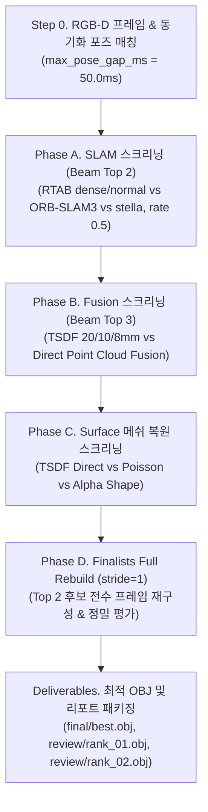

# 📊 Multi-Axis SLAM & 3D Reconstruction 벤치마크 가이드

`scripts/pipeline/compare.sh`를 통한 3D 복원 파이프라인 자동 최적화 및 빔 서치(Beam Search) 기반 벤치마크 실행 가이드입니다.

---

## 🚀 1. CLI 실행 방법

```bash
./scripts/pipeline/compare.sh <BAG_NAME> [옵션]
```

### 실행 옵션 요약
| 구분 | 플래그 | 설명 |
|---|---|---|
| **모드** | *(기본값)* / `--standard` | 표준 빔 서치 탐색 (Top-2 SLAM → Top-3 Fusion → Top-2 Surface → Top-2 Full Rebuild) |
| | `--quick` | 빠른 디버깅용 (적은 프레임/후보군, 0.5x 백엔드 4종) |
| | `--full` | 완전 탐색 모드 (Top-3 SLAM / Top-4 Fusion / Top-3 Full Rebuild, BPA, CGAL 포함) |
| **단계** | `--phase=all` *(기본)* | Phase A → Phase B → Phase C → Phase D (Full Rebuild) 전체 실행 |
| | `--phase=a` / `--phase=slam` | Phase A (SLAM 궤적 스크리닝)만 실행 |
| | `--phase=b` / `--phase=fusion` | Phase B (TSDF 해상도 vs Direct Point Cloud Fusion)만 실행 |
| | `--phase=c` / `--phase=surface` | Phase C (표면 복원 알고리즘 비교)만 실행 |
| **제어** | `--run-slam` | 궤적 누락 시 `run_slam.sh`로 자동 생성 (rate 0.5 표준화) |
| | `--no-cache` (`--force`) | 기존 캐시 무시하고 강제 재생성 |
| | `--top-k N` | Review 디렉터리에 내보낼 상위 후보 수 (기본: 2) |

```bash
# 기본 권장 실행 (표준 빔 서치 + Top-2 Full Rebuild)
./scripts/pipeline/compare.sh room01

# SLAM 궤적 자동 생성 포함 실행
./scripts/pipeline/compare.sh room01 --run-slam

# 전체 모드 실행 (고밀도 검증)
./scripts/pipeline/compare.sh room01 --full
```

---

## 🔄 2. 빔 서치 및 파이프라인 흐름



### [Step 0] Canonical RGB-D 프레임 & 포즈 매칭
- `rosbag2`에서 동기화된 RGB, Depth 이미지 및 카메라 파라미터(`camera_info.json`)를 추출합니다.
- 프레임-궤적 간 최대 허용 시간 간격을 **`max_pose_gap_ms = 50.0ms`** 로 통일하여 엄격한 SLERP 보간 및 유효성 검증을 수행합니다.

### [Phase A] SLAM 궤적 스크리닝 (Beam Width = Top 2)
- **비교 대상**: `rtab_dense_rate0.5`, `rtab_normal_rate0.5`, `orb_rgbd_rate0.5`, `orb_rgbdi_rate0.5`, `stella_rgbd_rate0.5`
- **선정 방식**: 단일 승자 독식이 아닌 상위 2개 우수 SLAM 궤적을 Phase B 빔(Beam)으로 전파합니다.

### [Phase B] Fusion 스크리닝 (TSDF vs Direct Point Cloud Fusion)
- **비교 대상**:
  1. **Open3D TSDF VoxelBlockGrid**: 20mm, 10mm, 8mm (trunc_mult=4.0 표준)
  2. **Direct Point Cloud Fusion Baseline**: TSDF 그리드 없이 RGB-D 프레임을 월드 좌표계로 역투영($R \cdot p + t$) 후 복셀 다운샘플링 및 아웃라이어 필터링
- **선정 방식**: 생존한 SLAM과 결합하여 상위 3개 Fusion 파이프라인을 선정합니다.

### [Phase C] 표면 복원 알고리즘 스크리닝 (Surface Reconstruction)
- **비교 대상**:
  - `TSDF Direct` (GPU 기반 다이렉트 등가면 추출)
  - `Screened Poisson Reconstruction` (밀폐형 수밀 메쉬)
  - `Alpha Shape` (경량 오목 껍질 메쉬)
  - *(Full 모드 전용)* `Ball Pivoting (BPA)`, `CGAL Polygonal`
- **선정 방식**: 상위 2개 Finalist 조합을 확정합니다.

### [Phase D] Top 2 Finalists FULL REBUILD (stride=1)
- 스크리닝 단계(stride > 1)를 거친 상위 2개 최종 후보에 대해 **`stride=1` (전체 학습 프레임 전수 통합)** 로 재구성(Full Rebuild)을 수행합니다.
- 풀 해상도 Raycasting 및 Depth 렌더링, Point-to-Mesh 거리 기반으로 최종 1위와 2위를 가리고 상호 비교 가능한 `.obj`를 보존합니다.

---

## 📂 3. 산출물 및 시각 검수

### 산출물 디렉터리 (`ros2_data/evaluations/<BAG_NAME>/`)
```text
ros2_data/evaluations/<BAG_NAME>/
├── benchmark_report.md      # SLAM / Fusion / Surface / Top 2 Rebuild 종합 리포트
├── experiment_manifest.json # 실행 메타데이터, requested/effective params, 재현 파라미터
├── rankings.json            # 최종 순위 및 점수
├── final/
│   ├── best.obj             # 최종 1위 우승 3D 표면 메쉬 (Full Rebuild)
│   ├── best_config.json     # 최적 파이프라인 파라미터 설정
│   └── quality_report.json  # 최종 정량 품질 평가 지표
└── review/
    ├── rank_01.obj          # 1위 메쉬 (stride=1, 비교용)
    └── rank_02.obj          # 2위 메쉬 (stride=1, 비교용)
```

### 3D 메쉬 시각화 검수
```bash
# 최종 최적 메쉬 확인
./scripts/utils/view_mesh.sh ros2_data/evaluations/room01/final/best.obj

# 상위 1위 / 2위 후보 비교 확인
./scripts/utils/view_mesh.sh ros2_data/evaluations/room01/review/rank_01.obj
./scripts/utils/view_mesh.sh ros2_data/evaluations/room01/review/rank_02.obj
```
