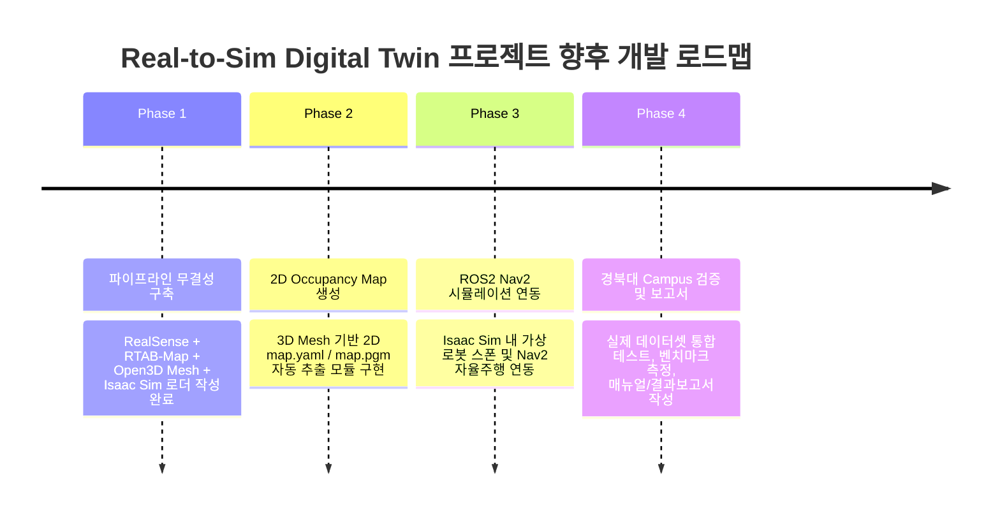

# Real-to-Sim Digital Twin Project: Next Steps & Optimization Plan

이 문서는 [`docs/proposal_2026.pdf`](file:///C:/KTHYEONG_github/auto-mobility/docs/proposal_2026.pdf) 제안서 요구사항을 바탕으로, 현재 구현된 파이프라인의 달성도를 평가하고 향후 완성을 위해 추진해야 할 **남은 핵심 과제 및 최적화/고도화 방안**을 정의합니다.

---

## 1. 제안서 대비 현재 달성도 점검

| 제안서 주요 수행 내용 | 진행 상태 | 현재 구현 수준 |
| :--- | :---: | :--- |
| **① RGB, Depth, IMU 센서 데이터 취득** | **100% 완료** | RealSense D435i 토픽 수신 및 실시간 FPS 검증 완료 |
| **② ROS2 센서 데이터 수집 및 시각화** | **100% 완료** | ROS2 Bag (MCAP) 녹화 및 RAM 디스크 백업 파이프라인 구축 완료 |
| **③ Visual SLAM 알고리즘 테스트** | **100% 완료** | RTAB-Map SLAM 파이프라인 구축 완료 (`rtabmap.db`) |
| **④ Point Cloud & Open3D Mesh 생성** | **100% 완료** | Poisson Surface Reconstruction, 이상치 필터링, RGB 전이 완료 |
| **⑤ Isaac Sim 환경 구축 & Mesh 활용** | **100% 완료** | Standalone Python API 로더, Light/Ground 및 **PhysX Collision** 적용 완료 |
| **⑥ Isaac Sim 내 ROS2 Navigation2 수행** | ⏳ **다음 단계** | 구축된 디지털 트윈 상에서 가상 로봇 주행 및 2D Occupancy Grid Map 변환 연동 필요 |
| **⑦ 경북대 Campus 환경 통합 및 검증** | ⏳ **최종 단계** | 실내/캠퍼스 스캔 데이터셋 확보 및 매뉴얼/결과보고서 작성 |

---

## 2. 남은 핵심 과제 (Missing Pieces for Proposal Completion)

제안서 목표의 핵심 문구인 **"생성된 디지털 트윈 환경을 NVIDIA Isaac Sim으로 변환한 후 ROS2 기반 Navigation을 수행하여 실제 환경과 시뮬레이션 환경을 연결"**하는 과제를 완수하기 위해 아래 2가지 핵심 모듈을 개발합니다.

### 2.1 3D Mesh ➔ 2D Occupancy Grid Map (`.yaml`, `.pgm`) 자동 추출 모듈
- **필요성:** ROS2 Nav2(Navigation2) 패키지(AMCL / Costmap2D)를 구동하려면 3D Mesh 환경에서 로봇이 다닐 수 있는 바닥과 장애물 벽면을 나타내는 2D 평면 격자 지도가 필수적입니다.
- **구현 방안:**
  - Isaac Sim의 내장 확장 기능인 `omni.isaac.occupancy_grid` Extension 또는 Open3D Bounding Box / Slice 알고리즘을 활용합니다.
  - 구축된 3D Mesh 상에서 특정 Z-높이(예: 로봇 바퀴~센서 높이)의 장애물을 슬라이싱하여 Nav2 표준 포맷인 `map.yaml` 및 `map.pgm`으로 자동 변환해 저장하는 유틸리티 스크립트 작성.

### 2.2 Isaac Sim 내 가상 로봇 스폰 및 ROS2 Navigation2 연동
- **필요성:** 디지털 트윈 공간 내부에서 가상 로봇(TurtleBot3, Carter 등)이 ROS2 Nav2 액션 명령을 받아 자율주행할 수 있어야 제안서의 Real-to-Sim 파이프라인이 완성됩니다.
- **구현 방안:**
  - Isaac Sim Stage에 ROS2 Control 및 JointStatePublisher / TF가 연동된 가상 로봇 URDF/USD 모델 스폰.
  - Isaac Sim 내 가상 LiDAR / Depth 카메라 센서 토픽과 ROS2 Nav2 런치 파일 연동.
  - Goal Pose 입력 시 시뮬레이션 환경에서 실제 공간 디지털 트윈 맵을 따라 자율주행 수행.

---

## 3. 최적화 및 고도화 방안 (Optimization & Enhancements)

시뮬레이션 렌더링 성능, 물리 연산 속도 및 정밀도를 극대화하기 위한 3가지 고도화 방안입니다.

### 3.1 Mesh 폴리곤 경량화 (Quadric Decimation / Simplification)
- **목적:** Poisson Reconstruction으로 생성된 Mesh의 삼각면(Triangle) 수가 과도하게 많으면 시뮬레이터 렌더링 프레임레이트(FPS) 및 PhysX 연산 속도가 떨어집니다.
- **방안:** [`src/auto_mobility/processing/mesh_open3d.py`](file:///C:/KTHYEONG_github/auto-mobility/src/auto_mobility/processing/mesh_open3d.py)에 Open3D의 `mesh.simplify_quadric_decimation()`을 추가 적용하여 기하학적 형태는 유지하되 정점(Vertex) 수를 50~70% 경량화합니다.

### 3.2 Native USD 포맷 변환 및 PBR Material 라이팅 적용
- **목적:** `.obj` 포맷 대신 NVIDIA Omniverse의 네이티브 3D 포맷인 **USD (`.usd` / `.usda`)**로 직렬화하여 로딩 속도를 향상시키고 텍스처 정밀도를 극대화합니다.
- **방안:** Open3D Mesh를 `pxr` USD Python API를 이용해 PBR Material 속성이 포함된 `.usd` 파일로 직렬화하는 변환 유틸리티 작성.

### 3.3 자동화 벤치마크 평가 시스템 수립
- **목적:** 디지털 트윈 구축 파이프라인의 성능과 품질을 정량적 지표로 평가하여 최종 보고서에 활용합니다.
- **방안:**
  - 스캔 면적 대비 Mesh 생성 소요 시간 측정
  - 생성된 Mesh 정점 밀도 및 복원 정밀도 수치화
  - Isaac Sim 구동 시 시뮬레이션 FPS 및 Nav2 도달 성공률 자동 로깅 스크립트 작성

---

## 4. 향후 개발 로드맵 (Execution Roadmap)

